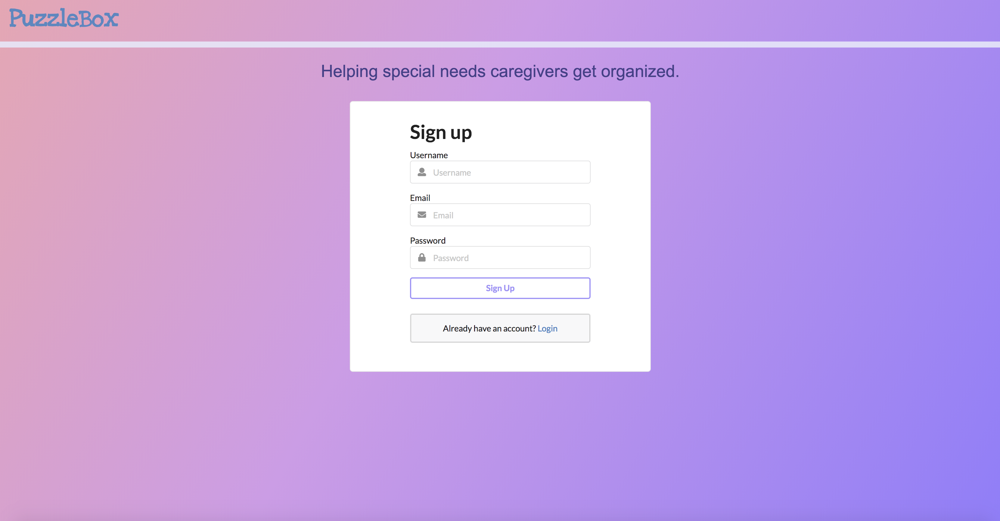

# PuzzleBox

## Introduction
Welcome to PuzzleBox, where special needs caregivers get organized.

#### fig.1 The homepage.

## Background
Caring for a special needs child can be overwhelming.  Oftentimes I find myself scrambling to find a paperwork for a piece of information, searching my brain memory, or checking my phone for people and places that I need for my son.  So to get organized and have what I need for him in one place, I thought of building PuzzleBox.  Puzzle is currently being used as a symbol for Autism, and Box referring to the box of paperwork that I have.  

Ahh...the beauty of being a web developer.  You get to build what you need to help yourself and other people as well.

## Built With
* Front End
     - ReactJS
          - [react-tabs](https://www.npmjs.com/package/react-tabs)
          - [semantic-ui-react](https://react.semantic-ui.com/introduction)
    - HTML5/CSS3

* Back End
    - ExpressJS
    - PostgreSQL


## Getting Started
Fork Clone Repo
```
$ git clone git@github.com:princessguerrero/PuzzleBox.git
```

npm install all dependencies in the backend and frontend
```
$ npm install
```

I used PostgreSQL for the backend.  In order to setup the database, you need to have Postgres and PSequel.  

Proceed to seed file:

```
$ node PuzzleBox/backend/db/puzzlebox.sql
```

You may run the project by typing the following in the terminal:

```
$ npm start
```

## How the App Works
1.  Sign up as a New User
    
     * Go to the sign up page and fill-out the necessary forms for the main user.  Once done you will automatically be logged in.
     * Next, click on the button that says Add a Child.  You will be directed to a form that you need to fill-out for the child.
     * Once you are done, you will be directed to a List of Children page (yes, you may add multiple children).  Click on a child's photo to view their profile.

2.  Child's Page
     * Here you will find a tab panel that has tabs for About, Services, Next Steps, and References.
          - About tab shows the information you entered in the form.
          - Services tab allows you to view/add a service provider.
          - Next Steps tab lets you view/type in the next goals for the child.
          - References tab allows you to enter a link, name and description of an online reference, as well as view the previous ones you have saved.


3. Log In
     * You may use your username and password to log in and access the Child's Page and your Main User Profile.
     

## The Future
I am looking to build the following for future features:
* Authorizing users to view the child's page.
* Ability to upload documents.
* Add Notes for each service provider visit.
